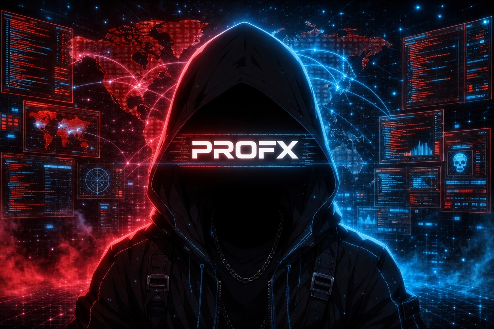

<!-- PROFX - GitHub Profile README -->
<!-- Terminal Boot Sequence Header -->

<div align="center">

<div align="center">

<!-- Profile Picture -->


<br/>

<!-- Typing Animation - Hacker Red -->


<br/>

<!-- Visitor Counter -->

&nbsp;


</div>

---

## `[ TECH STACK — WEAPONS LOADOUT ]`

<div align="center">

<!-- Programming Arsenal -->


<br/>


<br/><br/>

<!-- Web & Backend -->


<br/>


<br/><br/>

<!-- DevOps & Infrastructure -->


<br/>


</div>

---

## `[ OFFENSIVE ARSENAL — CLASSIFIED ]`

<div align="center">

<!-- Section Header -->


<br/><br/>

<!-- Operating Systems -->


<br/><br/>

<!-- C2 Frameworks -->
**`[ C2 FRAMEWORKS ]`**

<br/>


<br/><br/>

<!-- Network Tools -->
**`[ NETWORK ANALYSIS ]`**

<br/>


<br/><br/>

<!-- Web App Security -->
**`[ WEB APPLICATION SECURITY ]`**

<br/>


<br/><br/>

<!-- Password & Exploitation -->
**`[ EXPLOITATION & CREDENTIALS ]`**

<br/>


<br/><br/>

<!-- Reverse Engineering & Forensics -->
**`[ REVERSE ENGINEERING & FORENSICS ]`**

<br/>


<br/><br/>

<!-- Wireless -->
**`[ WIRELESS ATTACK SURFACE ]`**

<br/>


</div>


---

## `[ SECURE COMMS ]`

<div align="center">


<br/>

[](https://github.com/PROFXdeveloper)
[](https://tryhackme.com)
[](https://hackthebox.com)

</div>

---

<div align="center">

```
 ╔════════════════════════════════════════════════════════════╗
 ║                                                            ║
 ║ I don't steal secrets. I inherit them from the careless.   ║
 ║                                          — PROFX           ║
 ║                                                            ║
 ╚════════════════════════════════════════════════════════════╝
```


</div>

<!-- EOF -->
